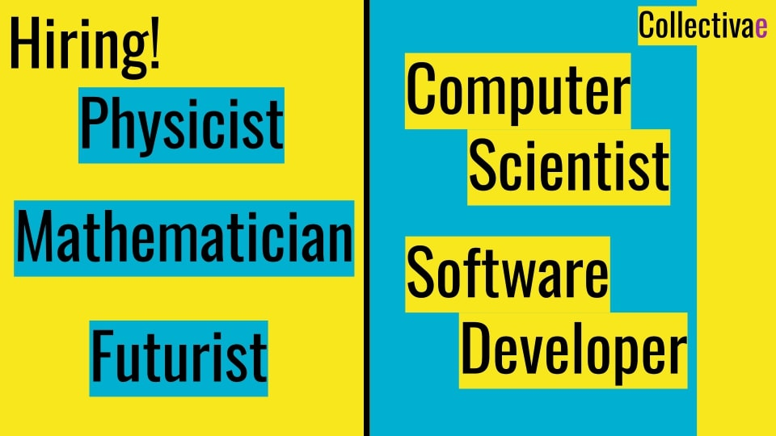

## Prelude

We believe innovation comes from the intersections of fresh multidisciplinary perspectives. We are hunting special unique talents. With freedom empowerment and the ownership value, We will succeed. 

## Qualifications

- We are not looking forward to your experience or skills.
- We are hunting candidates who are imaginative of a better future, passionate to tackle what no one thinks of, and adaptive to new domains.
- Students and fresh-graduates are encouraged to apply.
- Candidates with backgrounds of Physics, Pure Math, Applied Statistics, or Economics are encouraged to apply.

## Responsibility

- **Science.** Solution design, scientific modeling, implementation, and validation of small models. Mainly using Python, and possibly Julia.
- **Engineering.** Solution design, implementation, and quality testing of small apps. Mainly using Python or javascript, and possibly ocaml.
- **Business.** Listening and responding to customer feedbacks, and aligning them with the technical team flow.

## Tasks

### Physicist

- Check Meta's paper: [The Scientific Method in the Science of Machine Learning](https://ai.meta.com/research/publications/the-scientific-method-in-the-science-of-machine-learning/).
- Write a simple jupyter notebook showcasing the scientific method on any dataset of your choice.
- Synthetic data are allowed.

### Mathematician

- Check Silverman's book: [A Friendly Introduction to Number Theory](https://www.math.brown.edu/johsilve/frint.html).
- Select any exercise and solve it.
- Enlightning short proofs are preferred.

### Futurist

- Check NY Times Article: [He Created the Web. Now He’s Out to Remake the Digital World](https://www.nytimes.com/2021/01/10/technology/tim-berners-lee-privacy-internet.html).
- Highlight a problem the internet is suffering from in general, or from Tim's perspective.
- Envision a better future and possible practical roads to it.

### Computer Scientist

- Check the paper: [Sorting with Predictions](https://paperswithcode.com/paper/sorting-with-predictions-1).
- Design a heuristic algorithm, of a problem of your choice.
- Experiment the algorithm on a synthetic dataset to demonstrate the value of predictions.
- Which domain do you guess, shall benefit from that paradigm?

### Software Developer

- Check _Part 2: Event-Driven Architecture_ of the book: [Architecture Patterns with Python](https://www.cosmicpython.com/book/part2.html).
- Design and implement a hello-world software, using an architecture or design pattern of your choice.
- Select a software quality attribute, and test the software by it.

## Submission

### [Here](https://forms.gle/P5JKSpPX6g9N4C47A)

Please don't submit any Microsoft Office file.

## Question?

Ask on [Collectivae's LinkedIn](https://www.linkedin.com/company/collectivae/) profile.
